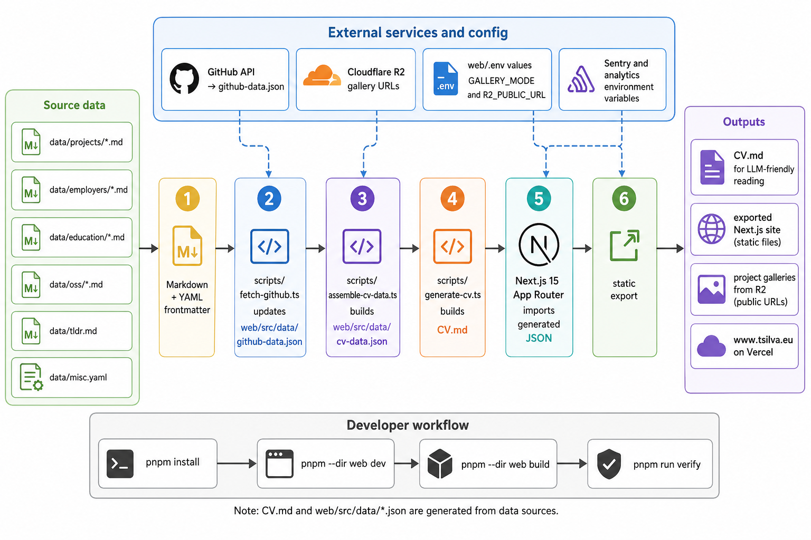

<div align="center">
  

  **A software engineer CV and interactive web experience covering 20+ years of work across 60+ shipped projects**

  [Live Site](https://www.tsilva.eu)
</div>

curriculum-vitae is the source repository for Tiago Silva's CV. It keeps the long-form professional history in structured Markdown files and publishes it as both a generated `CV.md` and a static Next.js website.

The web app is a cyberpunk-themed CV browser with project filtering, generated data files, remote project galleries, Sentry wiring, and Vercel static export.

## Install

```bash
git clone https://github.com/tsilva/curriculum-vitae.git
cd curriculum-vitae
pnpm install
npm --prefix web ci
npm --prefix web run dev -- --port auto
```

Open [http://localhost:3000](http://localhost:3000).

## Commands

```bash
npm --prefix web run dev -- --port auto # start Next.js on a random available port
npm --prefix web run build             # assemble data, generate CV.md, and static-export the site
npm --prefix web run build:local       # build with local gallery URLs
npm --prefix web run assemble          # regenerate web/src/data/cv-data.json for R2 galleries
npm --prefix web run assemble:local    # regenerate web data with local gallery URLs
npm --prefix web run generate:cv       # regenerate CV.md from data/
npm --prefix web run sync              # fetch GitHub data, assemble web data, and regenerate CV.md
npm --prefix web run lint              # run ESLint
npm --prefix web run typecheck         # run TypeScript without emitting files
npm --prefix web run stats             # count technology mentions
pnpm run smoke                 # run Playwright smoke tests
pnpm run verify                # lint, build, and run smoke tests
```

## Notes

- `data/` is the source of truth for CV content. Edit the relevant file under `data/projects/`, `data/employers/`, `data/education/`, `data/oss/`, `data/tldr.md`, or `data/misc.yaml`.
- `CV.md`, `web/src/data/cv-data.json`, and `web/src/data/github-data.json` are generated outputs. Regenerate them instead of hand-editing them.
- Gallery source data is controlled by `GALLERY_MODE` and `R2_PUBLIC_URL` in `web/.env`; production emits same-origin `/galleries/*?v=<cache-token>` URLs and proxies them to Cloudflare R2.
- Browser metadata uses `NEXT_PUBLIC_SITE_URL`; analytics and Sentry use the variables documented in `web/.env.example`.
- Root Sentry issue tooling reads `SENTRY_AUTH_TOKEN`, `SENTRY_ORG`, `SENTRY_PROJECT`, and `SENTRY_BASE_URL` from `.env`.
- The Next.js app is configured for static export with unoptimized images. `vercel.json` sets security/cache headers, redirects `tsilva.eu` to `www.tsilva.eu`, and proxies `/galleries/*` to the R2 gallery host.
- Root browser tooling uses `pnpm@10.27.0`; the Vercel web app uses npm with a committed lockfile.

## Local credentials

Private local values declared in `.keyenv.toml` live in macOS Keychain. Run
`keyenv doctor` to verify them and launch credential-dependent commands with
`keyenv run -- <command>`. Python, Node, and their child processes receive the
values through their normal environment APIs. Keep only public or non-secret
configuration in dotenv files.

## Architecture



## License

[MIT](LICENSE)
